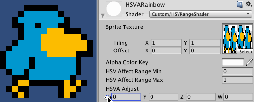
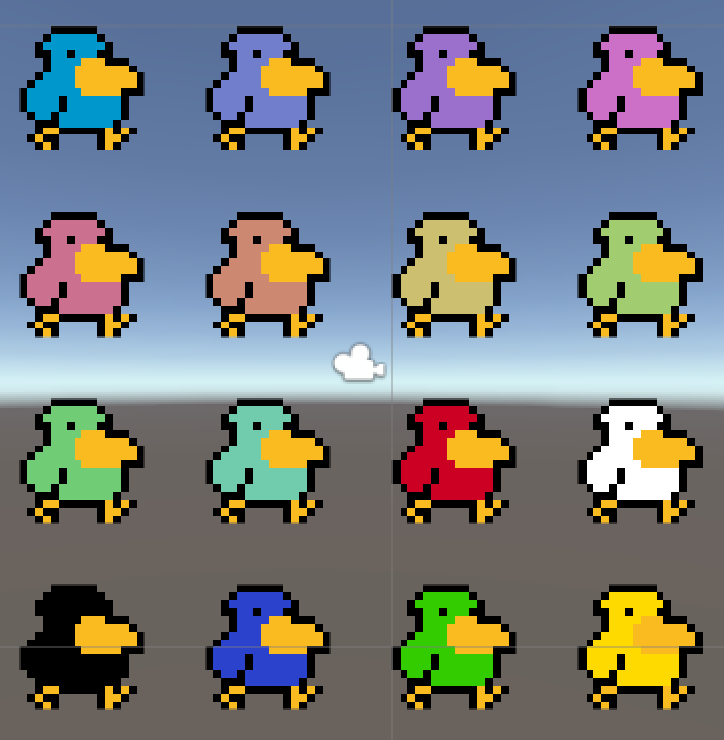
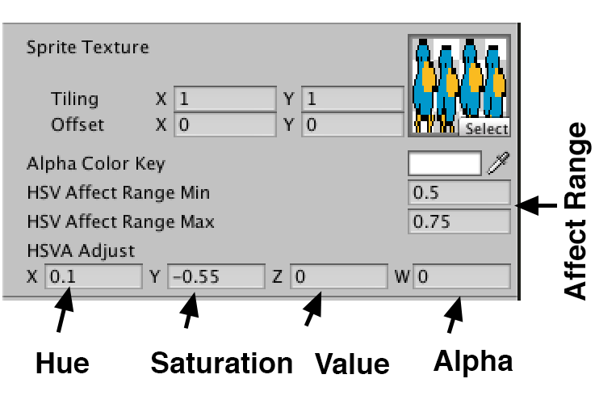
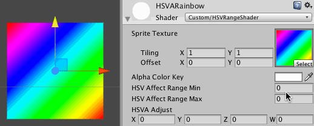
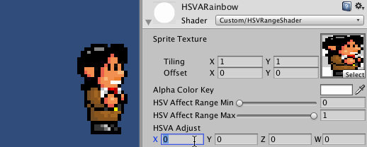

HSV Shader for Unity
====================

This is a selective hue saturation value adjuster for Unity.

I've used it in a couple of [unity](http://github.com/greggman/hft-unity2dplatformer)
[projects](http://github.com/greggman/hft-unity-multi-game-example) to generate different color
characters rather than use different textures. I'm sure there are other
maybe even better ways but this worked for me.

It works by letting you set a hue, saturation, value, and alpha
adjustment. Each value goes from -1 to 1. So for example setting
the saturation to 1 would make everything the maximum saturation.
Setting it 0 means leave it as is. Setting to -1 means remove
all saturation.

You can think of hue as a color wheel going from 0 to 1 (normally it would go from 0 to 360 degrees but
shaders work better with numbers that go form 0 to 1).

So, setting the hue adjustment to 0.5 moves all the colors half way around the color wheel. Setting it
to -0.2 would move them backward 20% of the way around the color wheel.

Finally you can set an affect range by hue. Only colors inside that range will be effected.
This let's you take a character, like the bird at the top, figure out what hue range is body
is in, and only effect his body. His beak and his outline are not effected.

This should work with more complex characters as well as long as the area you want to affect
can be isolated by hue range.

The easist way to find a range is to load up a sprite, set the hue adjust to 0.5 (half way around
the color wheel) and then adjust the min and max until only the part of the sprite you want
adjusted matches the range. Once you have that figured out you be good to go

You can [download or copy and paste the shader from here](https://github.com/greggman/hsva-unity/blob/master/Assets/Shaders/HSVRangeShader.shader).

### HSL version

There is an HSL version of this shader as well. It uses the HSL color space instead of the HSV color
space. The results are different. For example saturating a yellow gradient seems to work better
with this shader.

You can [download or copy and paste the shader from here](https://github.com/greggman/hsva-unity/blob/master/Assets/Shaders/HSLRangeShader.shader).

### License

MIT License

Copyright 2015, Gregg Tavares.
All rights reserved.

Redistribution and use in source and binary forms, with or without
modification, are permitted provided that the following conditions are
met:

*   Redistributions of source code must retain the above copyright
    notice, this list of conditions and the following disclaimer.

*   Redistributions in binary form must reproduce the above
    copyright notice, this list of conditions and the following disclaimer
    in the documentation and/or other materials provided with the
    distribution.

*   Neither the name of Gregg Tavares. nor the names of its
    contributors may be used to endorse or promote products derived from
    this software without specific prior written permission.

THIS SOFTWARE IS PROVIDED BY THE COPYRIGHT HOLDERS AND CONTRIBUTORS
"AS IS" AND ANY EXPRESS OR IMPLIED WARRANTIES, INCLUDING, BUT NOT
LIMITED TO, THE IMPLIED WARRANTIES OF MERCHANTABILITY AND FITNESS FOR
A PARTICULAR PURPOSE ARE DISCLAIMED. IN NO EVENT SHALL THE COPYRIGHT
OWNER OR CONTRIBUTORS BE LIABLE FOR ANY DIRECT, INDIRECT, INCIDENTAL,
SPECIAL, EXEMPLARY, OR CONSEQUENTIAL DAMAGES (INCLUDING, BUT NOT
LIMITED TO, PROCUREMENT OF SUBSTITUTE GOODS OR SERVICES; LOSS OF USE,
DATA, OR PROFITS; OR BUSINESS INTERRUPTION) HOWEVER CAUSED AND ON ANY
THEORY OF LIABILITY, WHETHER IN CONTRACT, STRICT LIABILITY, OR TORT
(INCLUDING NEGLIGENCE OR OTHERWISE) ARISING IN ANY WAY OUT OF THE USE
OF THIS SOFTWARE, EVEN IF ADVISED OF THE POSSIBILITY OF SUCH DAMAGE.

### Attribution for the art

---
#### Bird

*   author: Nooks
*   url: http://forums.tigsource.com/index.php?topic=9353.0

---
#### Super Miyamoto

*   author: larsiusprime
*   url: http://opengameart.org/content/super-miyamoto
*   license: CC-BY 3.0

